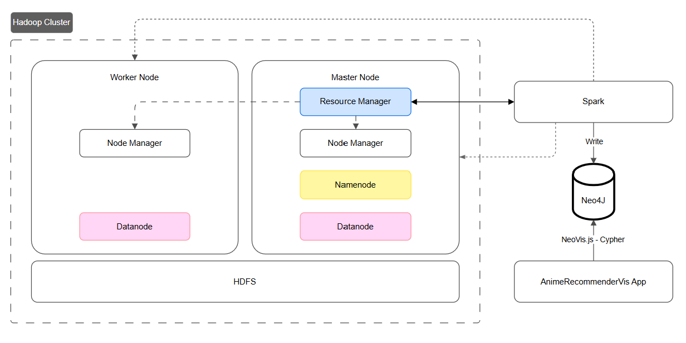
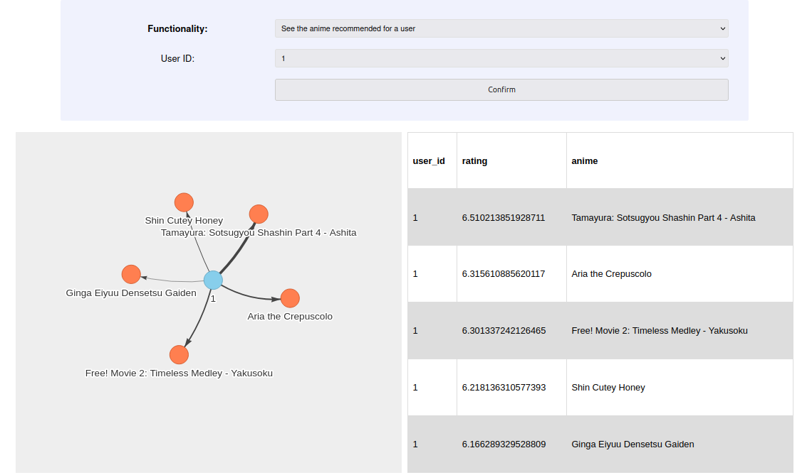

# AnimeRecommenderVis


- [AnimeRecommender](#animerecommender)
  - [Obiettivo](#obiettivo)
  - [Dataset iniziale](#dataset-iniziale)
  - [Algortimo ALS](#algortimo-als)
  - [Algoritmo di content-based filtering](#algoritmo-di-content-based-filtering)
  - [Prerequisiti](#prerequisiti)
  - [Architettura del sistema](#architettura-del-sistema)
    - [Funzionamento](#funzionamento)
  - [Configurazione cluster Hadoop](#configurazione-cluster-hadoop)
    - [Connessione delle macchine virtuali](#connessione-delle-macchine-virtuali)
    - [Configurazioni file Hadoop](#configurazioni-file-hadoop)
      - [Configurazioni comuni ad entrambi i nodi](#configurazioni-comuni-ad-entrambi-i-nodi)
      - [Solo master](#solo-master)
      - [Solo worker](#solo-worker)
      - [Solo master](#solo-master-1)
    - [Configurazioni file Spark](#configurazioni-file-spark)
      - [Solo master](#solo-master-2)
  - [Utilizzo](#utilizzo)
    - [0. Installazione componenti necessarie](#0-installazione-componenti-necessarie)
      - [Variabili d'ambiente](#variabili-dambiente)
    - [1. Esecuzione dell'applicazione Spark](#1-esecuzione-dellapplicazione-spark)
    - [2. Avvio dell'applicazione web](#2-avvio-dellapplicazione-web)
    - [3. Interruzione del cluster Hadoop](#3-interruzione-del-cluster-hadoop)
  
<div style="page-break-before: always;"></div>

## Obiettivo
L'obiettivo principale del progetto è quello di creare un sistema di raccomandazione di anime efficiente e scalabile, in grado di fornire suggerimenti personalizzati agli utenti basati sulle loro preferenze e sulle caratteristiche degli anime stessi. A tale scopo sono state impiegate tecnologie per il calcolo distribuito (Hadoop e Spark), e Neo4j per la l’archiviazione e la visualizzazione dei dati su anime, utenti e loro relazioni risultanti dall’elaborazione.<br>
Inoltre, per facilitare l'accesso e l'esplorazione dei dati, è stata sviluppata un'interfaccia grafica semplice ed intuitiva, che consenta a chiunque di interagire con le informazioni relative ad utenti, anime e raccomandazioni, offrendo funzionalità di query del database predefinite ed eliminando la necessità di scrivere manualmente query Cypher.


## Dataset iniziale
Il dataset utilizzato, disponibile al seguente [link](https://www.kaggle.com/datasets/dbdmobile/myanimelist-dataset), comprende informazioni relative agli anime e agli utenti e le valutazioni che questi ultimi hanno attribuito agli anime che hanno visto.<br>
Il dataset è composto complessivamente da sei file CSV, ma per questo progetto sono stati utilizzati:
- `users-score.csv`: contiene le valutazioni date dagli utenti agli anime (24,325,191 record). A causa delle eccessive dimensioni, spropositate rispetto all'infrastruttura di calcolo a disposizione, tale dataset è stato sottocampionato di un fattore 100. Di questo sono stati utilizzati i campi:
  - **user_id**: ID univoco dell'utente;
  - **anime_id**: ID univoco dell’anime;
  - **rating**: valutazione data dall'utente (scala da 1 a 10);
- `anime-filtered.csv`: contiene informazioni su diversi attributi e caratteristiche di ogni anime, aggiornate al 2020. Il dataset è comprensivo di 25 colonne, ma ai fini dell’applicazione sono stati considerati i seguenti campi:
  - **anime_id**: ID univoco dell’anime;
  - **Name**: titolo dell’anime;
  - **Score**: valutazione media dell’anime;
  - **Genres**: elenco dei generi dell’anime separati da ", ";
  - **synopsis**: una breve descrizione della trama dell’anime;
  - **Type**: indica se si tratta di un film, serie TV, ecc.;
  - **Episodes**: numero di episodi dell’anime;
  - **Source**: indica da dove è tratto l’anime (Manga, Original, ecc.);
  - **Rating**: classificazione dell’anime (G, PG-13, ecc.);
- `users-details-2023.csv`: contiene i dati relativi agli utenti (731,290). I campi utilizzati sono:
  - **Mal_id**: ID univoco dell'utente (poi rinominato **user_id**);
  - **Username**: username dell’utente;

## Algortimo ALS
Per la generazione delle raccomandazioni sulla base dei voti espressi dagli utenti è stato utilizzato l'algoritmo ALS (Alternating Least Squares) fornito dalla libreria PySpark.

L'algoritmo ALS è un metodo di machine learning ampiamente utilizzato per la generazione di raccomandazioni personalizzate, sfruttando la decomposizione di matrici sparse per identificare i fattori latenti che rappresentano le preferenze degli utenti e le caratteristiche degli elementi (nel caso specifico, anime). Ciò permette di comprendere le relazioni tra di essi.<br>
Le fasi principali sono:
1. **Fattorizzazione della matrice *Utente-Elemento***: l'algoritmo prende in input la matrice sparsa delle valutazioni e la fattorizza in due matrici più piccole:
   - matrice *Utente*: contiene i fattori latenti degli utenti;
   - matrice *Elemento*: contiene i fattori latenti degli elementi.
2. **Ottimizzazione alternata**: l'algoritmo alterna iterativamente due fasi di ottimizzazione fino a convergenza:
   - **ottimizzazione della matrice *Utente***: fissata la matrice *Elemento*, viene aggiornata la matrice *Utente* utilizzando il metodo dei minimi quadrati.
   - **ottimizzazione della matrice *Elemento***: fissata la matrice *Utente*, viene aggiornata la matrice Elemento utilizzando il metodo dei minimi quadrati.
     
Una volta ottenute le matrici *Utente* ed *Elemento*, la valutazione prevista per un utente rispetto ad un determinato elemento è calcolata come il prodotto scalare delle righe corrispondenti nelle due matrici. Infine, gli elementi raccomandati per un utente sono quelli con valutazione maggiore.

## Algoritmo di content-based filtering
Il content-based filtering è una tecnica di raccomandazione personalizzata che si basa sull’analisi delle caratteristiche degli oggetti (in questo caso anime).
Abbiamo implementato un algoritmo di content based filtering che stabilisce la similarità tra due oggetti (anime) valutando la cosine similarity tra i due vettori che codificano le loro feature più rilevanti:<br>
**cosine_similarity(A, B)** = (A · B) / (||A|| * ||B||) = sum(A_i * B_i) / (sqrt(sum(A_i^2)) * sqrt(sum(B_i^2)))<br>
La cosine similarty misura semplicemente il coseno dell'angolo compreso tra i due vettori, senza tener conto della norma di questi ultimi.
Il suo range è [-1, 1], dove 1 rappresenta vettori identici (a meno della norma), -1 rappresenta vettori che puntano in direzioni opposte, e 0 indica vettori ortogonali (scorrelati).

## Prerequisiti
In questa sezione sono elencati i prerequisiti software necessari per l'esecuzione del sistema:
1. **Apache Hadoop 3.4.1**;
2. **Apache Spark 3.5.5**;
3. **Java 11**;
4. **Neo4j 4.4**;
5. **Python Driver for Neo4j**: connettore *neo4j-python*. Installabile attraverso:
   ```
   pip install neo4j
   ```
6. **Notebook Jupyter**: installabile attraverso:
   ```
   pip install notebook
   ```
<div style="page-break-before: always;"></div>

## Architettura del sistema
 

Il sistema è composto da diversi componenti interconnessi che collaborano per fornire una soluzione completa per la raccomandazione di anime e l'analisi dei dati:
1. **Cluster Hadoop**: è composto da due macchine virtuali:
   - **master**: funge sia da NameNode che da DataNode, oltre ad agire come Resource Manager per la gestione delle risorse nel cluster;
   - **worker**: funge da DataNode.
   Entrambi i nodi includono il Node Manager, usato per la gestione delle risorse computazionali del nodo durante l'esecuzione distribuita di applicazioni YARN.

2. **Applicazione Spark**: gli obiettivi dell'applicazione Spark sono:
   1. creazione del modello ALS di raccomandazione di anime;
   2. implementazione dell’algoritmo di content-based filtering per il calcolo della similarità tra anime;
   3. generazione delle raccomandazioni;
   4. caricamento dei dati nel database Neo4j.<br>
L'applicazione viene eseguita sul cluster Hadoop attraverso YARN e sfrutta il filesystem distribuito HDFS per l'accesso al dataset iniziale.

3. **Database Neo4j**: usato per l'archiviazione dei dati originali, delle raccomandazioni generate dal modello ALS e dei coefficienti di similarità calcolati dall’algoritmo di content-based filtering.
   - Facilita l'analisi delle relazioni tra utenti e anime.

4. **Applicazione web**: fornisce un'interfaccia utente semplice per esplorare le raccomandazioni e le relazioni tra utenti e anime e similarità tra anime in modo visuale, attraverso query predefinite. È stata sviluppata con le classiche tecnologie web: HTML, CSS e JavaScript e si compone dei seguenti file:
	- `index.html`: punto d'accesso all'applicazione in cui è definita la struttura di base dell'interfaccia grafica, oltre che includere riferimenti a file JavaScript e CSS;
   	- `style.css`: è il file di styling del'interfaccia grafica;
	- `config.js`: contiene la configurazione per NeoVis e quella del driver usato per l'accesso a Neo4j.
	- `constants.js`: contiene delle costanti utilizzate dall'applicazione;
	- `util.js`: include funzioni JavaScript comuni, utilizzate in vari punti dell'applicazione;
	- `init.js`: contiene la logica di avvio dell'applicazione;
	- `functionality.js`: contiene una funzione JavaScript per ogni funzionalità, cioè per ogni possibile query al database Neo4j offerta dall'applicazione.

### Funzionamento
AnimeRecommenderVis funziona segue un preciso flusso di lavoro:
1. **Caricamento del dataset di partenza in HDFS**: Il dataset viene caricato nel filesystem distribuito HDFS del cluster Hadoop.
2. **Esecuzione dell'applicazione Spark**: l'applicazione Spark si compone dei seguenti step:
   1. Lettura del dataset di partenza da HDFS;
   2. Esplorazione e analisi del dataset: prevede l'esecuzione delle analisi preliminari sul dataset per comprendere meglio le caratteristiche dei dati, filtrarli e pulirli se necessario;
   3. Split del dataset in training e test, il primo utilizzato per addestrare il modello e il secondo per valutarne le prestazioni;
   4. Generazione del modello di raccomandazione:
      - il modello viene creato utilizzando l'algoritmo ALS;
      - è stata effettuata una cross-validation per trovare i parametri ottimali del modello.
   5. Validazione del modello utilizzando il set di test per verificare la sua accuratezza e capacità predittiva;
   6. Generazione delle raccomandazioni utilizzando il modello generato;
   7. Generazione dei coefficienti di similarità utilizzando l’algoritmo di content-based filtering
   8. Salvataggio dei dati in Neo4j: sia i dati originali che le raccomandazioni generate vengono importati nel database Neo4j.
3. **Visualizzazione dati con l'applicazione web**: in seguito è mostrato un esempio:

 

## Configurazione cluster Hadoop
### Connessione delle macchine virtuali
Prima di procedere alla configurazione di Hadoop, è necessario assicurarsi che le macchine virtuali siano correttamente connesse e configurate. Di seguito sono riportati i passaggi principali per stabilire una connessione tra le macchine virtuali:
1. **Creazione della rete NAT**: per consentire la comunicazione tra le macchine virtuali, è stata creata una rete NAT all'interno dell'ambiente di virtualizzazione. La rete consente alle macchine virtuali di comunicare tra loro e con l'esterno.
2. **Configurazione dei file *hosts* e *hostname***: per garantire che le macchine possano identificarsi reciprocamente all'interno della rete sono stati modificati i seguenti file:
   - `/etc/hostname`: aggiornare l'hostname in entrambe le macchine:
     - **master**: 
         ```
         master
         ```
     - **worker**: 
         ```
         worker
         ```
   - `/etc/hosts`: in entrambe le macchine virtuali aggiungere:
  
      ```
      ip-master    master
      ip-worker    worker
      ```
      **NOTA**: sostituire `ip-master` e `ip-worker` con gli indirizzi IP corrispondenti.

3. **Connessione tramite SSH**: per consente al master di accedere ai worker senza dover inserire manualmente la password.
   - sul nodo **master**:
     1. `ssh-keygen`: per generare le chiavi;
     2. `ssh-copy-id user@worker`: per copiare la chiave pubblica sul nodo worker;
     3. `ssh-copy-id user@master`: per copiare la chiave pubblica sul nodo master.
   
### Configurazioni file Hadoop
Una volta che le macchine virtuali sono correttamente connesse, è possibile procedere con la configurazione di Hadoop. <br>
**NOTA:** i file si trovano in `$HADOOP_DIR/etc/hadoop`.
#### Configurazioni comuni ad entrambi i nodi
1. `core-site.xml`: è il file in cui sono definite le configurazioni principali per Hadoop.
   ```
     <property>
        <name>fs.defaultFS</name>
        <value>hdfs://master:9000</value>
     </property>

   ```
   - La proprietà `fs.defaultFS` permette di definire l'URI del filesystem predefinito che Hadoop utilizzerà per le operazioni di I/O: deve avere come valore l'URI del namenode. 
2.  `yarn-site.xml`: è il file di configurazione specifico per  YARN.
     ```    
    <property>
        <name>yarn.resourcemanager.hostname</name>
        <value>master</value>
    </property>
     <property>
        <name>yarn.resourcemanager.address</name>
        <value>master:8032</value>
    </property>
    ```
    - La proprietà `yarn.resourcemanager.hostname` è usata per definire l'hostname del ResourceManager, ovvero master.
#### Solo master
1. `hdfs-site.xml`: contiene le impostazioni specifiche per il filesystem distribuito HDFS.
    ```    
   <property>
        <name>dfs.replication</name>
        <value>1</value>
    </property>
    <property>
  	    <name>dfs.namenode.rpc-address</name>
  	    <value>master:9000</value>
    </property>
    <property>
        <name>dfs.namenode.name.dir</name>
        <value>/home/user/hadoop-3.4.1/namenode-dir</value>
    </property>
    <property>
        <name>dfs.datanode.data.dir</name>
        <value>/home/user/hadoop-3.4.1/datanode-dir</value>
    </property>
    ```
    - La proprietà `dfs.replication` definisce il numero di repliche dei blocchi dei dati (1: senza replicazione);
    - Le proprietà `dfs.namenode.name.dir` e `dfs.datanode.data.dir` specificano i percorsi del filesystem locale dove rispettivamente il namenode e il datanode memorizzano i propri dati.
2. `worker`: il file deve contenere gli indirizzi dei datanode:
    ```
    worker
    master
    ```
#### Solo worker
1. `hdfs-site.xml`:
    ```  
    <property>
  	    <name>dfs.namenode.rpc-address</name>
  	    <value>master:9000</value>
    </property>  
    <property>
        <name>dfs.datanode.data.dir</name>
        <value>/home/user/hadoop-3.4.1/datanode2-dir</value>
    </property>

    ```
#### Solo master
Dopo aver apportato le modifiche, è necessario formattare il filesystem HDFS:

   ```  
   cd $HADOOP_DIR/bin
   hdfs namenode -format 
   ```
Per verificare la corretta configurazione:
1. Avviare i servizi HDFS:
```
 $HADOOP_HOME/sbin/start-dfs.sh
 ```
2. Avviare i servizi YARN:
```
 $HADOOP_HOME/sbin/start-yarn.sh
 ```
### Configurazioni file Spark 
#### Solo master
**NOTA:** i file si trovano in `$SPARK_HOME/conf/`.
1. `spark-env.sh`: assicurarsi che le variabili di ambiente HADOOP_CONF_DIR e YARN_CONF_DIR puntino alle directory di configurazione di Hadoop e YARN rispettivamente.
   ```
    export HADOOP_CONF_DIR=$HADOOP_DIR/etc/hadoop
    export YARN_CONF_DIR=$HADOOP_DIR/etc/hadoop
   ```
2. `spark-defaults.conf`: aggiungere la seguente configurazione per fare in modo che Spark utilizzi YARN come gestore delle risorse:
   ```
   spark.master yarn
   ```

<div style="page-break-before: always;"></div>


## Utilizzo
**NOTA**: scaricare il repository nel nodo master.
### 0. Installazione componenti necessarie
È possibile utilizzare lo script Backend/0-install.sh per installare tutte le componenti necessarie, nel caso in cui non fossero già presenti.
#### Variabili d'ambiente
Il sistema prevede di lavorare con tre variabili d'ambiente, che vengono utilizzate negli script presenti nella cartella Backend:
```
HADOOP_DIR="path/to/hadoop/dir"
SPARK_HOME="path/to/spark/dir"
JAVA_HOME="path/to/java/dir"
```

### 1. Esecuzione dell'applicazione Spark
Tutte le operazioni relative all'avvio del cluster Hadoop, caricamento del dataset in HDFS (da scaricare al link indicato sopra), avvio di Spark e di Neo4j, necessarie per l'esecuzione dell'applicazione Spark, sono incluse nello script *Backend/1-start-create-recommendation.sh*. Per questo motivo, per avviare l'applicazione Spark, è sufficiente eseguire lo script *Backend/1-start-create-recommendation.sh*.

L'esecuzione dell'applicazione Spark (contenuta nel notebook *Backend/create-recommendation.ipynb*) permette di popolare il database Neo4j con le raccomandazioni calcolate in modo permanente, per questo è suffciente eseguirla solo al primo avvio del sistema.
### 2. Avvio dell'applicazione web
L'applicazione web può essere facilmente avviata attraverso lo script *Backend/2-start-app.sh*.
### 3. Interruzione del cluster Hadoop
Eseguendo lo script *Backend/3-stop-all.sh* è possibile fermare l'intero cluster Hadoop, Spark e Neo4j.

